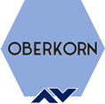

[](https://github.com/jfvilasPersonal/oberkorn/stargazers)
[](https://jfvilaspersonal.github.io/oberkorn/#/contributing)
[](https://jfvilaspersonal.github.io/oberkorn)


# Oberkorn
Oberkorn is a fresh project for creating an easy way to protect web applications deployed to kubernetes clusters based on JWT authorization mechanisms. Initial version has been specifically designed to work with Kubernetes and Nginx Ingresss Controller, but we are actively adding more support regarding other Ingress integrations.

The project is fully open sourced, you can access the repositories, review the code and ask for new features. You can even help us correcting and improving the code. [Any help will be welcomed](https://jfvilaspersonal.github.io/oberkorn/#/contributing)!

## Docs & Getting started
If you need some documentation on how to install and configure Oberkorn you can visit our home page [here](https://jfvilaspersonal.github.io/oberkorn).

What follows is a simple installation and starting guide.

### Installation
**Step 1**. Create the CRD.

```yaml
kubectl apply -f https://raw.githubusercontent.com/jfvilasPersonal/jwta-controller/main/crd/crd.yaml
```

This will create a CRD which you will use to create your ahtorizators.

**Step 2**. Deploy the controller.
The controller is the software component in charge of managing your authorizators. It listens for kubernetes events like ADD, DELETE o MODIFY anytime you create, remove or modify one authorizator. To deploy the controller you just need to apply following YAML.

```yaml
kubectl apply -f https://raw.githubusercontent.com/jfvilasPersonal/jwta-controller/main/crd/controller.yaml
```

The controller YAML contains several kubernetes resources:

 - A *Deployment*, which launchs a pod based on the JWTA Controller image ('jwta-controller' available on docker hub).
 - A *Service Account*. The controller needs some permission to manage resources inside the cluster, laike creating services, or deployments, so we need a service account that we assign to the deployment.
 - A *Cluster Role*. The permissions needed by the controller are defined inside a cluster role named 'jwta-controller-sa'.
 - Finally, a *Cluster Role Binding* named 'jwta-controller-crb' assigns the cluster role to the created service account.

You can check whether the controller is ready by examining controller stdout (the logs of the pod) and searching for the message "JWTA controller is watching events...".

### Your first authorizator
Once the setup is completed (and the controller has fully started) you can create your first JWTA authorizator. Next you can find a simple authorizator code to protect access to a typical SPA (Angular, React...) application served from "/" (your root URI) and accesing REST APIs published under "/api". In this example the access to the web application is protected using JWT tokens emitted by an AWS Cognito service. In addition, your web application must be accesible from outside kubernetes cluster through an Nginx Ingress Controller (named 'sample-nginx-ingress' in namespace 'test' in this example).

```yaml
apiVersion: jfvilas.at.outlook.com/v1
kind: JwtAuthorizator
metadata:
  name: sample-spa-web-authorizator
  namespace: test
spec:
  config:
    replicas: 2
  ingress:
    name: sample-nginx-ingress
    class: nginx
    provider: nginx-ingress
  validators:
    - cognito:
        name: cognito-validator
        region: eu-west-1
        userpool: eu-west-1_abcdefg
        iss: https://cognito-idp.eu-west-1.amazonaws.com/eu-west-1_abcdefg
  ruleset:
    # unrestricted
    - uri: "/"
      uritype: "exact"
      type: "unrestricted"
    # token must existe and be valid
    - uri: "/api/"
      uritype: "prefix"
      type: "valid"
```

And that's it!

Please check [our homepage](https://jfvilaspersonal.github.io/oberkorn) with all the **details of the project** and **reference documentation** on how to create and configure authorizators for **different scenarios**.


## Architecture primer
Here you can see the overall Oberkorn architecture.


>image and minimal explanation

## Repository
This repository conatins only the documentation of the project. The whole project is made up of three other projects:

  - [JWTA Controller](https://github.com/jfvilasPersonal/jwta-controller). It's just a Kubernetes controller for deploying and managing JWT Authorizators for your applications.
  - [JWTA Authorizator](https://github.com/jfvilasPersonal/jwta-authorizator). The source code for the authorizator module is kept here.
  - [JWTA Demo](https://github.com/jfvilasPersonal/jwta-demo). This is a demo application you can use to test your rules and some validators like Azure B2C, AWS Cognito...

